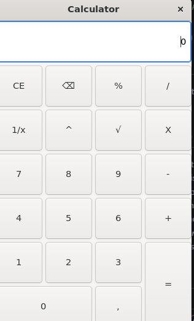

# CALCULATOR WITH GUI BUILT IN C 

a simple desktop calculator built in C with  GTK 3 (GTK 4 is availaible too )




## What does it do ? 

- Basic arithmetic- Basic arithmetic operations: addition, subtraction, multiplication, division
- Power and modulo operations
- Square root and inverse operations
- Clear and backspace buttons
- *Custom event when the result is equal to 67*
- Sound effect and shake animation  

## Built With

- C
- GTK 3
- GLib


## Requirements

On Debian/Ubuntu:

```bash
sudo apt install build-essential pkg-config libgtk-3-dev pulseaudio-utils
````


## Run

```bash
./calculator
```
